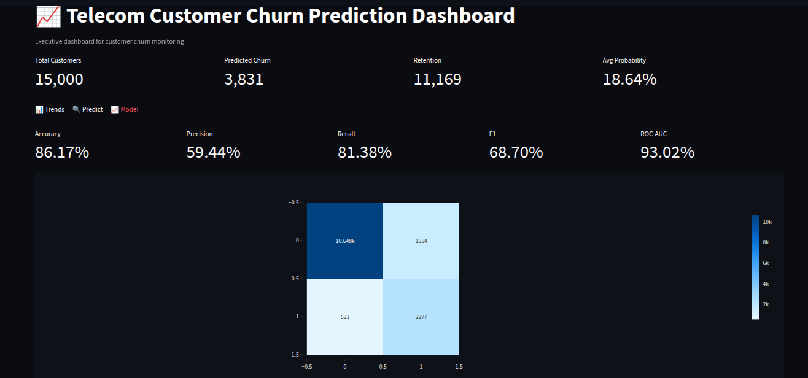

# UI Screenshots Index

> Visual reference of every surface the project exposes. PNGs live in
> `dashboards/screenshots/` and are committed to git so they render directly
> on GitHub.

## Local Streamlit dashboard

The four screenshots below were taken against `streamlit run
dashboards/churn_dashboard_app.py` on port 8501.

### 1. Landing / KPI section


The header shows four KPIs: Total Customers, Predicted Churn, Retention, and
Average Probability. The sidebar exposes the classification threshold slider
and the risk-segment filter.

### 2. Trends tab


* **Churn Probability Distribution** histogram, coloured by risk segment.
* **Risk Segment Distribution** pie chart.
* **Revenue vs Churn Risk** scatter (when `revenue` column is present).

### 3. Predict tab


Single-customer prediction form. Enter `Revenue`, `Regularity`, `Frequency`,
and `Data Volume` and the app returns the calibrated churn probability and
risk level inline.

### 4. Model tab


Top row shows the five core metrics (Accuracy, Precision, Recall, F1,
ROC-AUC) computed from `actual_churn` + `churn_prediction`. Below that:
the confusion matrix heatmap and the ROC curve.

## Surfaces without a packaged screenshot

For these, browse to the live URL or run the local equivalent — they update
automatically with each deploy so a static PNG would go stale:

| Surface | URL | Note |
|---|---|---|
| **Geography tab** (new) | http://localhost:8501 → tab "🌍 Geography" | Choropleth of churn risk over Senegal's 14 regions |
| **Azure Streamlit dashboard** | https://telechurn-streamlit.thankfulsand-f5821563.eastus.azurecontainerapps.io | Identical to the local app |
| **Streamlit Cloud dashboard** | https://telecom-churn-aerqyhwebuhgi3dc527hvv.streamlit.app | Identical, public, free tier |
| **Flask Swagger UI** | https://telechurn-flask.thankfulsand-f5821563.eastus.azurecontainerapps.io/ | Interactive OpenAPI explorer |
| **Airflow UI** | http://localhost:8080 (login `airflow / airflow`) | DAG graph for `telecom_churn_production_pipeline` |

## How to take an updated screenshot

```bash
# Open the dashboard on Windows and Win+Shift+S the region:
start http://localhost:8501

# Or via headless playwright (if installed):
playwright screenshot --full-page http://localhost:8501 dashboards/screenshots/00_dashboard.png
```

After taking new PNGs:

```bash
git add dashboards/screenshots/
git commit -m "docs: refresh dashboard screenshots"
git push
```

GitHub renders the inline images in this file automatically.

## File sizes (for the curious)

```
00_dashboard.png   ~150 KB
01_trends.png      ~180 KB
02_predict.png     ~120 KB
03_model.png       ~200 KB
```

All four together are < 1 MB, so they ship with the repo without polluting
the clone size.
